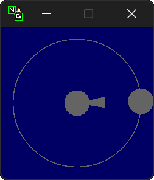

:toc:
:toc-placement!:
:toclevels: 4

:source-highlighter: highlight.js

ifdef::env-github[]
:tip-caption: :bulb:
:note-caption: :information_source:
:important-caption: :heavy_exclamation_mark:
:caution-caption: :fire:
:warning-caption: :warning:
endif::[]

:repo-files: https://github.com/justDeeevin/NuhxBoard/raw/main
:shields: https://img.shields.io

= image:{repo-files}/NuhxBoard.png[The NuhxBoard logo, 34] NuhxBoard

image:{shields}/crates/v/nuhxboard[Crates.io version]
image:{shields}/crates/l/nuhxboard[Crates.io license]
image:{shields}/crates/d/nuhxboard[Crates.io downloads]

image:https://gist.githubusercontent.com/hecrj/ad7ecd38f6e47ff3688a38c79fd108f0/raw/74384875ecbad02ae2a926425e9bcafd0695bade/color.svg[The Iced logo, 130, link=https://github.com/iced-rs/iced]

toc::[]

== Goals

https://github.com/ThoNohT/NohBoard[Nohboard] is great! But it's only for Windows. The only alternative is https://github.com/Tiyenti/kbdisplay[Tiyenti's KBDisplay], which is quite nice, but limited in functionality. My primary goal with this project is to replicate the functionality of NohBoard in a cross-compatible manner. More specifically, I want to be able to feed in any NohBoard config file and have near-identical output to NohBoard.

I may add functionality where I think it would fit, but I want to prioritize interoperability with NohBoard. Call it just another incentive for gamers to switch to Linux.

== Usage

NuhxBoard is made with customizability in mind. Every part of its appearance and behavior is configurable. At its core, NuhxBoard is an app that loads keyboard layouts and styles. A keyboard layout defines the positions, shapes, and behaviors of keys. It also defines the dimensions of the window. A style defines colors, fonts, and images.

Keyboard layouts are grouped into categories, and styles (aside from global ones) correspond to specific keyboard layouts.

Keyboards are located in `~/.local/share/NuhxBoard/keyboards`. Here's the general structure of that directory:

* keyboards/
** [CATEGORY NAME]/
*** images/
*** [KEYBOARD NAME]/
**** keyboard.json
**** [STYLE NAME].style
*** global/
**** [STYLE NAME].style

This folder will be populated on first run with some example keyboards and categories. You can inspect it yourself to get a good idea of how this looks in practice.

To load a keyboard and style, right-click anywhere in NuhxBoard to open the global context menu and click on "Load Keyboard". This will open a new window. The drop-down list labeled "Categories" allows you to select a category. When a category has been selected, the keyboards available in that category will appear in a list on the left side of the vertical line. When you click on one of these options, your selection of keyboard layout will be loaded, and that keyboard layout's available styles will appear in a list on the right side of the vertical line. When you click on one of these options, your selection of style will be loaded. You can change your selection of keyboard layout and style at any time through this interface.

=== Keyboard Layouts

As previously stated, keyboard layouts define key positions, shapes, and behaviors, as well as window dimensions. Keyboard layouts are defined by a JSON file, `keyboard.json`, in their corresponding named directory. Here's what the type definition for a keyboard layout looks like in rust:

[source, rust]
----
#[derive(Serialize, Deserialize, Default, Debug, JsonSchema)]
#[serde(rename_all = "PascalCase")]
pub struct Layout {
    pub version: Option<u8>,
    pub width: f32,
    pub height: f32,
    pub elements: Vec<BoardElement>,
}

#[derive(Serialize, Deserialize, Debug, Clone, JsonSchema)]
#[serde(tag = "__type")]
pub enum BoardElement {
    KeyboardKey(KeyboardKeyDefinition),
    MouseKey(MouseKeyDefinition),
    MouseScroll(MouseKeyDefinition),
    MouseSpeedIndicator(MouseSpeedIndicatorDefinition),
}

#[derive(Serialize, Deserialize, Debug, Clone, JsonSchema)]
#[serde(rename_all = "PascalCase")]
pub struct KeyboardKeyDefinition {
    pub id: u32,
    pub boundaries: Vec<SerializablePoint>,
    pub text_position: SerializablePoint,
    pub key_codes: Vec<u32>,
    pub text: String,
    pub shift_text: String,
    pub change_on_caps: bool,
}

#[derive(Serialize, Deserialize, Debug, Clone, JsonSchema)]
#[serde(rename_all = "PascalCase")]
pub struct MouseKeyDefinition {
    pub id: u32,
    pub boundaries: Vec<SerializablePoint>,
    pub text_position: SerializablePoint,
    pub key_codes: Vec<u32>,
    pub text: String,
}

#[derive(Serialize, Deserialize, Debug, Clone, JsonSchema)]
#[serde(rename_all = "PascalCase")]
pub struct MouseSpeedIndicatorDefinition {
    pub id: u32,
    pub location: SerializablePoint,
    pub radius: f32,
}

#[derive(Serialize, Deserialize, Debug, Clone, JsonSchema)]
#[serde(rename_all = "PascalCase")]
pub struct SerializablePoint {
    pub x: f32,
    pub y: f32,
}
----

If you can make sense of that, then good for you! Otherwise, here's an actual explanation of how a keyboard layout is defined.

==== Top-Level Properties

All points are represented as an object with an `X` and `Y` property.

Version:: No actual meaning. Kept for parity with NohBoard layout files.
Width:: Width of the window in pixels.
Height:: Height of the window in pixels.
Elements:: Array of elements in the layout.

==== Elements

There are four kinds of elements: KeyboardKeys, MouseKeys, MouseScrolls, and MouseSpeedIndicators. Each item in the list of elements indicates what kind it is by having a `__type` property.

---

===== Shared Properties

These properties are shared by KeyboardKeys, MouseKeys, and MouseScrolls.

Id:: Each element has a unique Id. Style files can apply styles to specific keys by referring to their Id.
Boundaries:: Elements' shapes are defined by an array of points, their vertices. When no image is specified for an element, it is drawn by connecting lines between each point in the order they appear in the list (including closing the shape by connecting the last vertex to the first), then filling the polygon formed. Even if an element has an image specified, the boundaries are used for the graphical layout editor to know when your cursor is hovering over an element.
TextPosition:: The point where the top-left corner of the element's text is to be. Technically, this can be anywhere in the window.
KeyCodes:: An array containing the keycodes (just integers) this key should track. You can have one element listen for multiple keys! NuhxBoard can automatically detect the proper keycode in edit mode, but xref:KEYCODES.adoc[this document] can be used for reference.
Text:: The text to display on the key.

---

===== KeyboardKey

In addition to the shared properties, KeyboardKeys have the following properties:

ShiftText:: The text to display when shift is held.
ChangeOnCaps:: Whether or not to follow the state of caps lock (generally, this is `true` for letters and `false` for symbols).

---

===== MouseSpeedIndicator

MouseSpeedIndicators are drawn differently, behave differently, and thus are defined differently. They have IDs, but none of the other shared properties.

MouseSpeedIndicators are made up of a filled inner circle and an unfilled outer ring. There is a triangle extending to a point along the outer ring. The direction of the triangle indicates the direction of the velocity of the mouse, and the closness of the triangle's end to the outer ring indicates the magnitude.

Location:: The center of the circle
Radius:: The radius of the outer ring. The inner ring is 20% of this radius.

---

=== Styles

Styles describe colors, fonts, and images with which to display a keyboard layout. Proper styling is crucial to making a good keyboard layout.

Again, here's the type definition in rust:

[source, rust]
----
#[derive(Serialize, Deserialize, Debug, JsonSchema)]
#[serde(rename_all = "PascalCase")]
pub struct Style {
    pub background_color: NohRgb,
    pub background_image_file_name: Option<String>,
    pub default_key_style: KeyStyle,
    pub default_mouse_speed_indicator_style: MouseSpeedIndicatorStyle,
    pub element_styles: Vec<ElementStyle>,
}

#[derive(Serialize, Deserialize, Debug, Clone, JsonSchema)]
pub struct NohRgb {
    #[serde(rename = "Red")]
    pub red: f32,
    #[serde(rename = "Green")]
    pub green: f32,
    #[serde(rename = "Blue")]
    pub blue: f32,
}

#[derive(Serialize, Deserialize, Debug, Clone, JsonSchema)]
#[serde(rename_all = "PascalCase")]
pub struct KeyStyle {
    pub loose: KeySubStyle,
    pub pressed: KeySubStyle,
}

#[derive(Serialize, Deserialize, Debug, Clone, JsonSchema)]
#[serde(rename_all = "PascalCase")]
pub struct KeySubStyle {
    pub background: NohRgb,
    pub text: NohRgb,
    pub outline: NohRgb,
    pub show_outline: bool,
    pub outline_width: u32,
    pub font: Font,
    pub background_image_file_name: Option<String>,
}

#[derive(Serialize, Deserialize, Debug, Clone, JsonSchema)]
#[serde(rename_all = "PascalCase")]
pub struct Font {
    pub font_family: String,
    pub size: f32,
    pub style: u8,
}

#[derive(Serialize, Deserialize, Debug, JsonSchema)]
#[serde(rename_all = "PascalCase")]
pub struct MouseSpeedIndicatorStyle {
    pub inner_color: NohRgb,
    pub outer_color: NohRgb,
    pub outline_width: f32,
}

#[derive(Serialize, Deserialize, Debug, JsonSchema)]
#[serde(rename_all = "PascalCase")]
pub struct ElementStyle {
    pub key: u32,
    pub value: ElementStyleUnion,
}

#[derive(Serialize, Deserialize, Debug, JsonSchema)]
#[serde(tag = "__type")]
pub enum ElementStyleUnion {
    KeyStyle(KeyStyle),
    MouseSpeedIndicatorStyle(MouseSpeedIndicatorStyle),
}
----

==== Top-Level Properties

All images are stored in the `images` directory in the *category*. Images are refferred to by name, *including the file extension*.

All colors are represented as an object with three properties: `Red`, `Green`, and `Blue`. Each is an integer between 0 and 255.

BackgroundColor:: The color of the background. Will be overriden by a background image if one is specified.
BackgroundImageFileName:: The name of the image file to use as the background. This is optional.
DefaultKeyStyle:: The default style to use for all "keys" (every element besides MouseSpeedIndicators). This _must be specified_.
DefaultMouseSpeedIndicatorStyle:: The default style to use for all MouseSpeedIndicators. This _must be specified_.
ElementStyles:: An array of ElementStyle objects. Each ElementStyle object has a `Key` property, which is the Id of the element to which the style should be applied, and a `Value` property, which is either a KeyStyle or a MouseSpeedIndicatorStyle. Again, each item indicates its type with the `__type` property.

---

==== KeyStyle

KeyStyles just list which style to use for when a key is `Pressed` or `Loose` (not pressed). The actual style is defined in the KeySubStyle object, with these properties:

Background:: The color of the key.
Text:: The color of the text on the key.
Outline:: The color of the outline around the key.
ShowOutline:: Whether or not to draw an outline around the key.
OutlineWidth:: The width of the outline in pixels.
Font:: The font to use for the text on the key. See <<Fonts>> for more information.
BackgroundImageFileName::
The name of the image file to use as the background of the key.

---

==== MouseSpeedIndicatorStyle

InnerColor:: The color of the filled inner circle.
OuterColor:: The color of the outer ring.
OutlineWidth:: The width of the outer ring.

---

==== Fonts

FontFamily:: The name of the font to use. This is the name of the font as it appears in the system's font list.
Size:: The size of the font in pixels.
Style:: A bitfield representing the style of the font. From least to most significant, the first bit is bold, the second italic, the third underline, and the fourth strikethrough. These effects can be combined. As an example, if I wanted bold and italicized text, I would set style to `3`, which is `0011` in binary.

---

=== Settings

In the global context menu, there is a "Settings" button, which opens a window with the following options:

Mouse sensitivity:: The sensitivity of the MouseSpeedIndicator.
Scroll hold time (ms):: Time in milliseconts to highlight a mouse scroll key when a scroll is detected.
Calculate mouse speed from center of screen:: Some games recenter the mouse every frame. If you find that you're looking around ingame but the MouseSpeedIndicator is behaving strangely, try turning this option on.
Display to use:: The ID of the display to use for the above option. The primary monitor is marked as such, but if you have many monitors, you'll probably have to use trial and error to determine which is which.
Show keypresses for at least _ ms:: A key will stay highlighted for this many milliseconds after it is released.
Window title::
Follow Caps-Lock and Shift:: These three radio buttons allow you to fine-tune capitalization behavior. With the last two options selected, caps lock will be ignored everywhere, and instead all keys will either be capitalized or lowercase depending upon your selection. The two checkboxes to the right allow you to still follow shift for certain keys. Think of this as allowing you to force caps lock to be either on or off for all keys. For instance, when NuhxBoard is configured to show all buttons capitalized but still follow shift for all keys, when shift is held, all keys will be lowercase, similar to if shift were held while caps lock was followed and enabled.
//

=== Edit Mode

You can graphically manipulate every part of a keyboard layout and style. In the global context menu, press "Start Editing" to enter edit mode. In this mode, you can

* Drag to move elements around
* Change the size of the window with the "Keyboard Properties" button in the edit mode context menu
* Change the style of the window and default element styles with the "Keyborad Style" button in the edit mode context menu
* Change various properties of the currently-hovered element with the "Element Properties" button in the edit mode context menu
* Change the color of the currently-hovered element with the "Element Style" button in the edit mode context menu

Most fields will instantly update as you change them. The exception is font families and images. In order to apply your changes to these fields, you must press Enter while the text box has focus.

You can use CTRL+Z to undo element movements, and CTRL+SHIFT+Z to redo them.

== Caveats

=== Linux

NuhxBoard will lack native Wayland support for the foreseeable future. This is due to the fact that Wayland provides no protocol for global input listening. However, through XWayland, NuhxBoard will still receive events when X11 applications have focus. The staggering majority of games with some version of Linux support (be it through proton or native support) use X11, so the primary usecase for NuhxBoard (being game recording) still works well enough.

=== MacOS

Doesn't work right now. :( +
Support is in the works.

== Installation

NuhxBoard is currently only on https://crates.io/crates/nuhxboard[crates.io]. It can also be installed with https://crates.io/crates/cargo-binstall[Cargo Binstall]. You can also install NuhxBoard using the option matching your platform on the https://github.com/thepyrotf2/nuhxboard/releases/latest[latest release page]. NixOS users can use the provided flake (output `packages.${system}.nuhxboard` or `packages.${system}.default`).

NuhxBoard will detect if any app files are missing and replace them automatically. This includes

The main settings:: If the `NuhxBoard.json` file containing app settings and saved state doesn't exist, it'll be populated with defaults.
Installed keyboards:: If the `keyboards` directory is empty or doesn't exist, then nuhxboard will download a pack of example keyboards to use.

== Demo

https://github.com/justDeeevin/NuhxBoard/assets/90054389/36dc9cf6-3b23-435c-a742-18dddf9c7c19

Configurable like NohBoard:

https://github.com/justDeeevin/NuhxBoard/assets/90054389/80c69a52-e76d-4715-a22c-78db34743959
