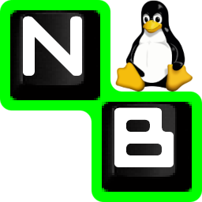

#  NuhxBoard


<a href="https://github.com/iced-rs/iced">
  
</a>

## Contents

1. [Goals](#goals)
2. [Usage](#usage)
3. [Installation](#installation)
   - [0.5.0](#050)
4. [Demo](#demo)

## Goals

[Nohboard](https://github.com/ThoNohT/NohBoard) is great! But it's only for Windows. The only alternative is [Tiyenti's KBDisplay](https://github.com/Tiyenti/kbdisplay), which is really great, but limited in functionality. My primary goal with this project is to replicate the functionality of NohBoard in a Linux-compatible manner. More specifically, I want to be able to feed in any NohBoard config file and have near-identical output to NohBoard.

I may add functionality where I think it would fit, but I want to prioritize interoperability with NohBoard. Call it just another incentive for gamers to switch to Linux.

## Usage

Right now, NuhxBoard has to be launched from the command line. In a future release, I plan on porting the graphical interface present in NohBoard. Launch arguments are used to decide the keyboard and style. This means that the app has to be relaunched to change the keyboard or style.

To specify a keyboard layout, provide the group and the keyboard name in the `--keyboard` argument, in the format `[GROUP]/[KEYBOARD]`. To specify a style, just provide the name of the style in the `--style` argument.

Here's the output of the `--help` command:

```
NuhxBoard - The cross-platform alternative to NohBoard

Usage: nuhxboard [OPTIONS] --keyboard <KEYBOARD>

Options:
  -k, --keyboard <KEYBOARD>  The keyboard to use. [GROUP]/[KEYBOARD]
  -s, --style <STYLE>        The style to use. Must be in the same directory as the provided keyboard. If not provided, global default will be used
  -l, --list                 List available keyboard groups or keyboards in a group specified by `--keyboard`
  -h, --help                 Print help
  -V, --version              Print version

Add keyboard groups to ~/.local/share/NuhxBoard/keyboards/
```

_God, I love `clap`._

## Installation

NuhxBoard is currently only on [crates.io](https://crates.io/crates/nuhxboard). It can also be installed with [`cargo-binstall`](https://crates.io/crates/cargo-binstall).
If you use Linux and either install without binstall or build from source, you will need the `libxi-dev` and `lib-xtst` packages installed.
You can also install NuhxBoard using the option matching your platform on the [latest release page](https://github.com/thepyrotf2/nuhxboard/releases/latest).

### 0.5.0

Version 0.5.0 Takes advantage of [`iced` version 0.12.0](https://github.com/iced-rs/iced)'s new features and [`iced_aw`](https://github.com/iced-rs/iced_aw)'s context menu to make the the application purely graphical, with a seperate window for loading a keyboard and error pop-up windows, getting closer to NohBoard's behavior and usage. However, there's a problem. While most parts of `iced_aw` work with `iced` v0.12.0, there are a couple things they still need to work on (see [this issue](https://github.com/iced-rs/iced_aw/issues/196)) before a new release, so I have to depend on its github repo to use its context menu. _Crates.io won't let you publish a crate with a git dependency_, so I can't release 0.5.0 until `iced_aw` has its next release.

So, if you want to use this latest version of NuhxBoard, for the time being, you'll have to build it from its source code.

1. Clone this repository
   Make sure Git is installed, then run `git clone https://github.com/justdeeevin/nuhxboard` in your terminal.
2. Build the app
   If you haven't already, [install Rust](https://www.rust-lang.org/learn/get-started). Make sure to install the nightly version, either during initial install or after with `rustup install nightly`.

   `cd` into the new folder:

   ```
   cd NuhxBoard
   ```

   Then build the app:

   ```
   cargo +nightly build --release
   ```

   This'll take a minute. Sorry.

3. Move the app somewhere on your PATH
   I would recommend putting it in `~/.cargo/bin` like so:

   ```
   mv ./target/release/nuhxboard ~/.cargo/bin
   ```

   (Use `nuhxboard.exe` instead of `nuhxboard` if on Windows. Although, you really should just use NohBoard if you're on Windows.)

## Demo

https://github.com/justDeeevin/NuhxBoard/assets/90054389/36dc9cf6-3b23-435c-a742-18dddf9c7c19

Configurable like NohBoard:

https://github.com/justDeeevin/NuhxBoard/assets/90054389/80c69a52-e76d-4715-a22c-78db34743959
